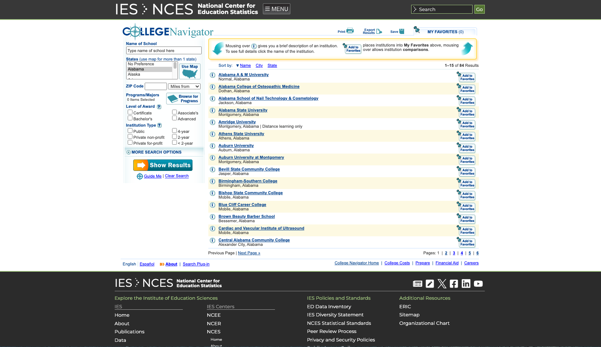
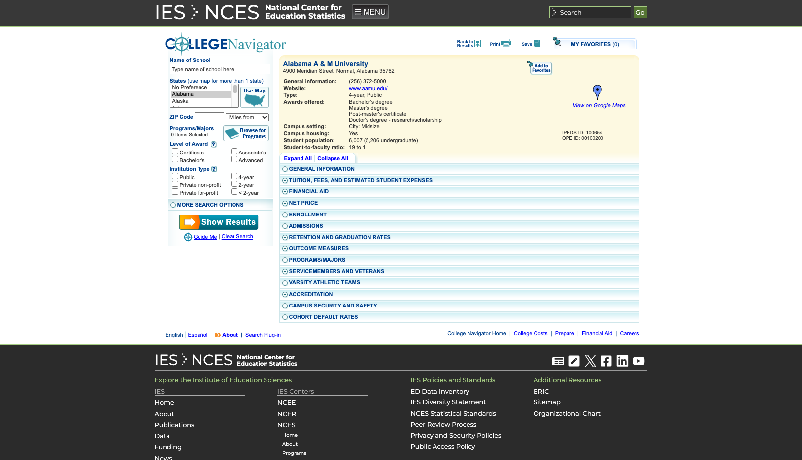
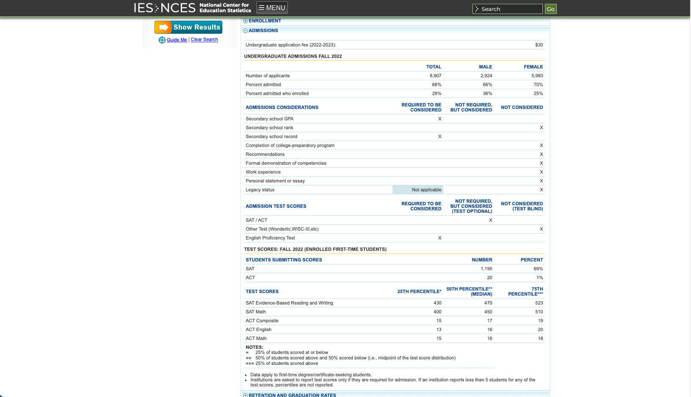

# College SAT Score Scraper

## Description
This Python script uses Selenium and BeautifulSoup to scrape SAT score percentile data from the National Center for Education Statistics College Navigator webpage. It contains SAT admissions data for colleges across various states in the USA. The data includes the 25th, 50th, and 75th percentile SAT scores for Evidence-Based Reading and Writing (EBRW) and Math. The script then saves this data into an SQLite database. It can easily be modified to scrape for any other data you might be interested in. 

If you had access to a list of the ID's the website uses to classify each school, the script could be made much faster by just iterating through those ID's in the URL. It would save a bunch of time not having to use Selenium. I didn't care to do this, since I just need to store the data in my db. The whole script can take anywhere from 5-7 hours to run, as it navigates through all 7,000 colleges/universities using Selenium.

## Features
- Scrapes SAT score data for colleges in all US states.
- Utilizes Selenium for web automation and BeautifulSoup for HTML parsing.
- Stores the scraped data in an SQLite database.
- Handles pagination on the website to navigate through multiple pages.

## Requirements
- Python 3.x
- Selenium
- BeautifulSoup4
- SQLite3
- Chrome WebDriver (or any other driver of your choice)

## Screenshots
The screenshot below is the main page for the state of Alabama on the college navigator tool. In contains all the colleges in a given state. This script iterates through all 50 states


The screenshot below is an example page of a school when clicked on from the states page. It contains all the data the National Center for Education Statistics has for that school in different dropdowns. The data this script looks for is in the "ADMISSIONS" dropdown.


The screenshot below is the "ADMISSIONS" dropdown once it has been clicked. It contains the SAT admissions' data the script is looking for. If the data isn't there (since a lot of schools don't require SAT scores to be submitted), it moves on to the next school.


## Installation
1. Clone the repository:
   ```bash
   git clone https://github.com/kpfister44/college-sat-score-scraper.git
2. Install the required Python packages:
    ```bash
    pip install selenium beautifulsoup4
3. Ensure you have the appropriate WebDriver for your browser (e.g., ChromeDriver for Google Chrome).

## Usage
1. Open `satAdmissionsScrapper.py` and modify the database path in the `sqlite3.connect` method as needed.
2. Run the script:
   ```bash
   python satAdmissionsScrapper.py
3. The script will automatically navigate through the website and store the data in the specified SQLite database.

## Database Schema
The SQLite database used by this script should have a table named `college_scores` with the following schema:
- `college_name` TEXT
- `sat_25th_percentile` INTEGER
- `sat_50th_percentile` INTEGER
- `sat_75th_percentile` INTEGER

Ensure this table is created in your database before running the script.

## Disclaimer
This script is intended for educational purposes only. Be aware of and comply with the terms of service of the website being scraped.

## License
[Specify your license choice here, if applicable]


